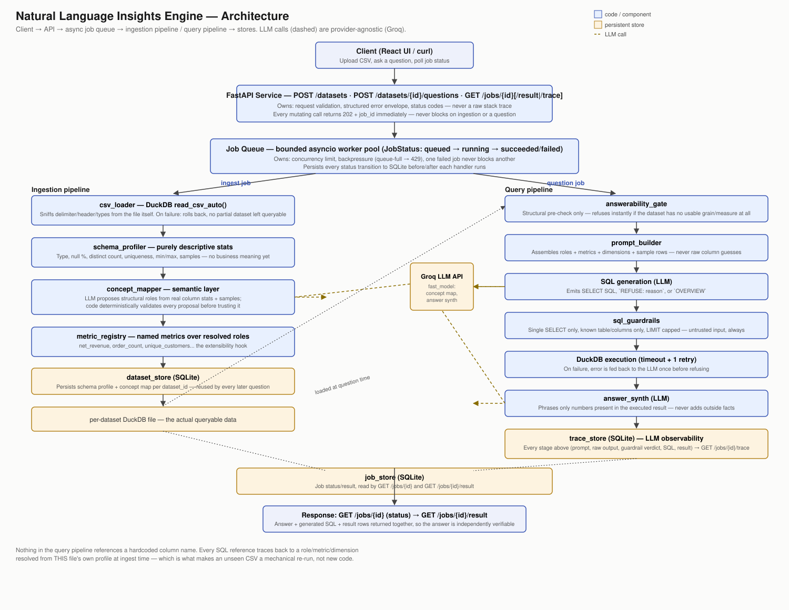

# System Design — Natural Language Insights Engine

## 1. Components and what each owns

| Component | Owns |
|---|---|
| **FastAPI service** (`app/main.py`, `app/api/*`) | HTTP surface: request validation, structured error envelope (`{"error": {"code","message"}}`), status codes. Every mutating endpoint returns `202 {job_id}` immediately. |
| **Job queue** (`app/jobs/queue.py`) | A bounded in-process asyncio worker pool. Owns concurrency limits, backpressure, and the `queued → running → succeeded/failed` state machine. |
| **Job / dataset / trace stores** (`app/jobs/store.py`, `app/ingestion/dataset_store.py`, `app/jobs/trace_store.py`) | SQLite-backed persistence for job status, per-dataset schema profile + concept map, and per-job pipeline traces. |
| **Ingestion** (`app/ingestion/csv_loader.py`, `schema_profiler.py`) | Loads an arbitrary CSV into a dedicated DuckDB file via `read_csv_auto`, then computes purely descriptive column statistics (type, nulls, cardinality, samples). No business meaning here. |
| **Semantic layer** (`app/semantic/concept_mapper.py`, `metric_registry.py`) | Turns the descriptive profile into business meaning: an LLM proposes structural roles (grouping id, entity id, item id, quantity, monetary amounts, per-line discount/surcharge/flat adjustments, event time) from the file's own column names/types/samples; code deterministically validates every proposal before trusting it. `metric_registry` defines named metrics purely in terms of resolved roles — the extensibility hook. |
| **NL→SQL pipeline** (`app/nlq/*`) | `prompt_builder` assembles the grounded context; the LLM generates SQL, a refusal, or an overview request; `sql_guardrails` validates the SQL is a single, safe SELECT against known tables/columns; `answer_synth` phrases the result, grounded only in what the query actually returned. |
| **React frontend** (`frontend/src`) | Upload, concept-map/schema preview, question box, job polling, answer + SQL + result table, and a trace panel showing how the answer was produced. |

## 2. The path a question takes, end to end

1. **Ingest** — `POST /datasets` saves the upload and returns `202 {job_id}` immediately. A worker runs `csv_loader` (DuckDB's own CSV sniffer handles delimiter/header/type detection), then `schema_profiler` computes objective stats per column. The **semantic layer** sends those stats — plus real sample values pulled from the file — to the LLM, which proposes a role for each of: `event_group_id`, `entity_id`, `item_id`, `item_label`, `quantity`, `unit_amount`, `line_discount_rate`, `line_surcharge_rate`, `line_amount_adjustment`, `line_amount`, `event_time`. Every proposal is checked against the real schema (column exists, not already claimed, structurally sane type — a discount/surcharge rate must additionally have every real value in [0, 1]) before being accepted; a rejected or absent proposal is `not_found`, never guessed. When `line_amount` has no direct total column, it's derived from `quantity * unit_amount` with any resolved discount/surcharge/flat-adjustment roles automatically composed on top — see §3 for why this needed a second fix after the first one. Any column not claimed by a role becomes a `dimension` (if it's a reasonable categorical breakdown) or is exposed raw as `unmapped` — nothing is dropped. The resolved profile + concept map + dimensions are persisted against the dataset id.
2. **Ask** — `POST /datasets/{id}/questions` returns `202 {job_id}`. A worker:
   - loads the persisted concept map and metric registry;
   - runs the **answerability gate**, a structural pre-check (does this dataset have any usable grain + measure at all?) that refuses instantly without an LLM round trip if not;
   - builds a prompt from the resolved roles, available named metrics, dimensions (with real sample values), a few sample rows, and the question — **never** a raw guessed column name;
   - the LLM responds with a SQL `SELECT`, `REFUSE: <reason>`, or `OVERVIEW` (a general "describe this dataset" request, answered from the same structure rather than one query);
   - `sql_guardrails` parses the SQL and rejects anything that isn't a single, safe SELECT against known tables/columns, then caps/injects a `LIMIT`;
   - the query executes against DuckDB with a timeout; on failure, the error is fed back to the LLM once for self-correction before refusing;
   - `answer_synth` phrases the result in natural language, constrained to only state numbers that are actually in the result rows;
   - every stage above is written to `trace_store` under the job id.
3. **Retrieve** — the client polls `GET /jobs/{id}` for status, then `GET /jobs/{id}/result` for the answer + generated SQL + result rows (so the answer is independently checkable), and can inspect `GET /jobs/{id}/trace` for exactly how it was produced.

## 3. How schema context is built from an unfamiliar file, and where it breaks

The mechanism is deliberately two-layered:

- **`schema_profiler` is pure statistics** — type, null fraction, distinct count, uniqueness ratio, min/max, samples. This never changes regardless of domain; it's the same code for a retail CSV or a hospital billing export.
- **`concept_mapper` is LLM-driven, not keyword-driven.** Earlier in development this was a hand-written synonym-list matcher (`"invoice"`, `"customer"`, `"product"`...). It broke on a synthetic rideshare CSV where the customer column was named `rider_handle` — not in any list I'd written — and got silently mis-assigned to the wrong role. The fix wasn't a bigger list (that's an unwinnable game against "column names you did not anticipate"); it was to stop guessing from a fixed vocabulary and instead give the LLM the file's own evidence — real column names, types, cardinality, and sample values — and let it propose roles using genuine language understanding. Every proposal is then deterministically validated: the column must exist, must not already be claimed, and must have a structurally sane type for that role. A proposal that fails validation is rejected outright, not silently patched.

This was stress-tested against real, previously-unseen datasets during development (not just the UCI dev set): a raw UCI Online Retail II export with zero pre-computed columns (revenue correctly **derived** as `quantity × price`), a rideshare CSV with unrelated vocabulary, a Superstore export with no product ID at all (`item_id` correctly stayed `not_found` rather than being forced), and a dataset with a column literally named "记录数" (Chinese for "record count") — normalized and correctly routed to `unmapped` rather than crashing anything.

**A concrete bug this caught, and the two-part fix.** An external test CSV (retail orders with a `promo_rate` column, no other adjustment) produced a "net revenue" that overstated the true value by exactly the discount amount on every row. Root cause: the original structural role catalog had no concept of a per-line discount at all, so `promo_rate` landed in `unmapped` and `line_amount` derived as plain `quantity × unit_amount` — silently gross, not net. Verified against raw ground-truth SQL on the same file: the app's wrong numbers matched *gross* revenue to the cent for every month checked.

The fix has two layers, on purpose, because a fixed catalog can never be complete:
1. **Three new structural roles** — `line_discount_rate` and `line_surcharge_rate` (fractional, validated as every real value in [0, 1] before being trusted — the same discount-vs-surcharge column can't accidentally validate as both, since one only reduces and the other only increases the derived total) and `line_amount_adjustment` (a flat monetary delta, no range restriction, covers flat fees/refunds). These are structural *patterns*, not a vocabulary list — the LLM still has to recognize a `vat_rate` or a `handling_fee` column from its name and sample values the same way it recognizes `rider_handle` as a customer id; the code only decides whether a *proposed* column is structurally plausible for that pattern once the LLM has named it. When more than one is resolved, they compose into a single expression in a fixed order (discount, then surcharge, then flat) so a dataset with all three at once still gets exactly one correct `line_amount`.
2. **A prompt-level caution rule for the ones that don't fit any pattern.** No fixed set of roles can be exhaustive (a `loyalty_points_redeemed`, a `currency_conversion_factor`, a bundle-savings column). The SQL-generation prompt (`nlq/prompt_builder.py`) already receives every unmapped column raw — it previously had no instruction to be suspicious of them. Rule 6 now tells the model: before trusting a named monetary metric, check whether any unmapped column still looks like it adjusts a total, and either incorporate it into custom SQL or refuse rather than present an answer that might be silently incomplete. This is the honest fallback for the residual case §3 can't structurally close — it depends on the LLM's judgment, not a deterministic check, which is why layer 1 exists for the common, nameable patterns and this is only the safety net behind it.

Stress-testing the fix on a genuinely new synthetic CSV with all three adjustments present at once (a discount, a VAT rate, *and* a handling fee, live against the real LLM, not a test stub) surfaced a second, subtler bug: the model correctly named all three adjustment columns individually, then refused to set `derive_from_quantity_and_unit_amount` at all, reasoning "no single total column; total would need multiple fields" — it didn't realize the system composes the adjustments automatically, so it tried to hold out for a single column that could never exist and `line_amount` came back `not_found` (net revenue would have been safely refused, but for the wrong reason). Fixed by making the prompt state explicitly that `quantity * unit_amount` is the correct *pre-adjustment* subtotal to derive from regardless of how many separate adjustment columns exist — re-verified live afterward against the same three-adjustment file with a correct, fully-composed expression.

A third followed on a real external dataset (Olist order items) that has no explicit quantity column at all — `unit_amount` ("price") was meant to alias directly as `line_amount` (quantity implicitly 1), but a resolved `freight_value` shipping-fee adjustment was silently dropped in that specific code path: only the fully-derived `quantity * unit_amount` branch composed discount/surcharge/adjustment roles on top, not the aliasing branch. Fixed by extracting the composition logic into one shared helper both branches call, so an adjustment applies consistently regardless of which path established the base line total. All three fixes are covered by deterministic unit tests (`test_concept_mapper.py`) that don't depend on live LLM behavior, plus live re-verification for the parts that do.

**A fourth, more structural bug surfaced re-testing the original UCI dev dataset itself** (a 25-column engineered version with several near-identical boolean flag columns — see the ingestion story below) after the roles above brought the total structural-role count to 11: concept mapping failed *every* live attempt, retry included, falling back to the conservative structural fallback and resolving nothing but `event_time`. The logged raw model output showed a consistent, reproducible pattern — `{"event_group_id":{...},{"entity_id":{...},{"item_id":{...}` — a stray `{` before every subsequent key instead of a comma-separated one. Root cause: asking the fast model for a single JSON *object* with 11 identically-shaped keys reads, to that model, like it wants to be a *list* of similarly-shaped items, and it kept drifting into array-style separators mid-object. Confirmed by testing the alternative directly against the same real file: wrapping the same content as `{"roles": [{"role": "event_group_id", ...}, ...]}` — an actual JSON array, which is what the model already wanted to produce — fixed it in 4/4 repeated live calls, where the object shape had just failed 4/4. This was a systemic, majority-of-the-time failure for any wide schema, not rare bad luck, and it would have hit the exact dataset the brief hands out as the primary dev dataset. Fixed by changing the wire contract to the array shape, with a small translation layer back to the internal per-role dict everything else already consumes — re-verified with three consecutive clean live ingests of the same file afterward.

**Where it still breaks, honestly:**
- **Business rules encoded in value conventions, not columns.** The raw UCI dataset marks cancelled orders by prefixing the invoice number with `C` — there's no `is_cancelled` column. The LLM's sample of that column (20 values) didn't happen to include one, so a question about cancellations was correctly refused rather than guessed — but a differently-sampled run might have caught it and answered inconsistently. Sample-based context can miss rare-but-important patterns.
- **Two legitimate entities, one `entity_id` slot.** A dataset with both a rider and a driver (two "who" concepts) can only have one mapped to `entity_id`; the other has to fall back to a generic `dimension`. The structural role catalog assumes one dominant entity grain.
- **Ambiguity between near-identical columns** (e.g. `unit_cost` vs `unit_price`, both numeric, both plausible `unit_amount` candidates) is resolved by the LLM's single choice with no second opinion recorded — a wrong pick isn't currently self-correcting until a specific question reveals it.
- **The LLM call itself can still fail** (rate limit, timeout, or a still-undiscovered malformed-output pattern the array-wire fix above didn't anticipate). One retry is built in; a second failure degrades to the conservative structural-only fallback that resolves almost nothing rather than risking a wrong guess. Safe, but a real capability cliff — and the concrete lesson from the bug above is that this path is worth actually exercising against wide, real files during development, not just trusting the retry to paper over whatever goes wrong.

## 4. The biggest decisions, and what was rejected

**1. DuckDB (embedded) over Postgres.** DuckDB needs zero server setup, has excellent native CSV type-sniffing (`read_csv_auto`), and is fast enough on 500k+ rows without tuning. Postgres would look more "production," but loading an arbitrary CSV's inferred schema into a real RDBMS is meaningfully more code, and a server dependency works against the 15-minute clean-machine setup requirement. Rejected because the cost wasn't worth it for what this system needs to prove.

**2. LLM-driven semantic layer with deterministic validation, over a hand-written keyword matcher.** Covered in detail in §3 — this is the decision that actually failed once during development and was replaced for a concrete, demonstrated reason, not a hypothetical one. The rejected alternative (name-pattern heuristics) is fundamentally bounded by whatever vocabulary was anticipated in advance, which directly conflicts with "cope with column names you did not anticipate." The tradeoff accepted: every ingest now costs one LLM round trip and depends on the LLM's judgment, mitigated by validating every proposal against the real schema before trusting it, and falling back conservatively (not guessing) when the LLM is unavailable.

**3. In-process asyncio job queue over Redis/Celery.** Zero extra infrastructure, trivially satisfies one-command setup, and is easy to reason about and defend live. The real cost: it doesn't survive a process restart mid-job and doesn't scale past one process. Concurrency is bounded by a worker-pool semaphore and a bounded queue (backpressure returns `429` rather than growing unbounded); a job's failure is caught and recorded per-job, never crashing a worker or blocking the rest of the queue. These are proven, not just narrated: `tests/test_job_queue.py` fills a size-1 queue and asserts the next submission gets rejected with `queue_full` rather than blocking, runs one failing and one succeeding job side by side and asserts the failure never touches the other, and runs three 0.2s jobs on a 3-worker pool and asserts they finish in well under the 0.6s serial time. Documented as the first thing to replace if this needed to run at real scale (§5).

**4. Groq (free-tier, open-weight models) over a paid frontier model, with a strict guardrail layer as compensation.** Open-weight models are less reliable at raw SQL generation and structured output than a frontier model — this was the direct cause of the malformed-JSON failure in §3. Rather than accept that risk unguarded, the system leans harder on deterministic validation everywhere the LLM's output touches something real: column existence and type checks on every role proposal, an AST-level SQL guardrail (single SELECT, known tables/columns only, no DDL/DML) before any generated SQL executes, and answer synthesis constrained to only repeat numbers present in the actual query result. The model can be swapped freely — `llm_client.py` is a thin provider-agnostic interface — without touching this validation layer.

## 5. What I'd build next, in order

1. **Harden the semantic layer's ambiguity handling** — when two columns are both plausible for the same role, surface both to the prompt as labeled candidates instead of the LLM silently picking one, so genuine ambiguity is visible rather than hidden in a single confident-looking proposal.
2. **Redis/Celery** for the job queue, once this needs to survive a restart or run across more than one process — the concrete next step flagged in decision 3.
3. **A small semantic cache** — keyed on (dataset schema hash, question), so re-asking or re-loading the same file skips re-profiling and re-answering. Free 10x on repeated demo/eval runs.
4. **Multi-entity role support** — let the concept map hold more than one `entity_id`-shaped role (e.g. buyer and seller) instead of forcing a single slot, closing the gap named in §3.
5. **Follow-up questions** — thread prior question/answer/SQL into the next prompt so "and by country?" works without restating context.
6. **Charts** — the result rows are already tabular; a minimal chart view is a frontend-only addition once the data contract is stable.

## What I cut, given the scope of this exercise

- **Redis/Celery, caching, follow-up questions, charts, cost tracking** — all in the Optional list, deliberately skipped per the brief ("skipping all of it costs you nothing"), documented above as what's next.
- **The two optional items I built anyway** (semantic layer as a first-class component, LLM observability via the trace store) were elevated specifically because they directly serve required, heavily-weighted requirements — genuine schema inference on an unfamiliar file, and being able to defend a live answer or refusal — not because more features are inherently better.
